# Eatsy

**Eatsy** is a web application for selling and buying essential products. It was inspired by Etsy and built using Python, React.js, and SQLAlchemy.

Explore and start buying at [Eatsy](https://eatsy-2022.herokuapp.com/)

## List of techs/languages/plugins/APIs used

- React.js

- Flux

- JSON API

- PostgreSQL

- Flask

- Heroku

- CSS

- HTML

## Landing Page

When a user is not logged in, landing page has some info about the porducts and a Sign in option

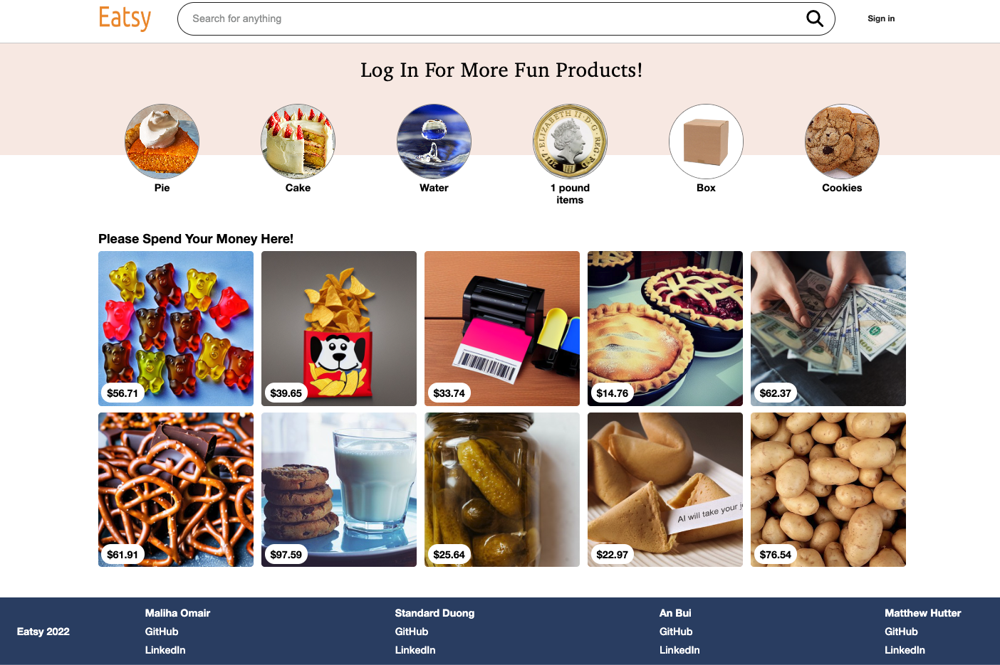

## Home Page

When a user is logged in or signed up, they'll be able to start shopping and selling. Or just browsing.

Sign In modal

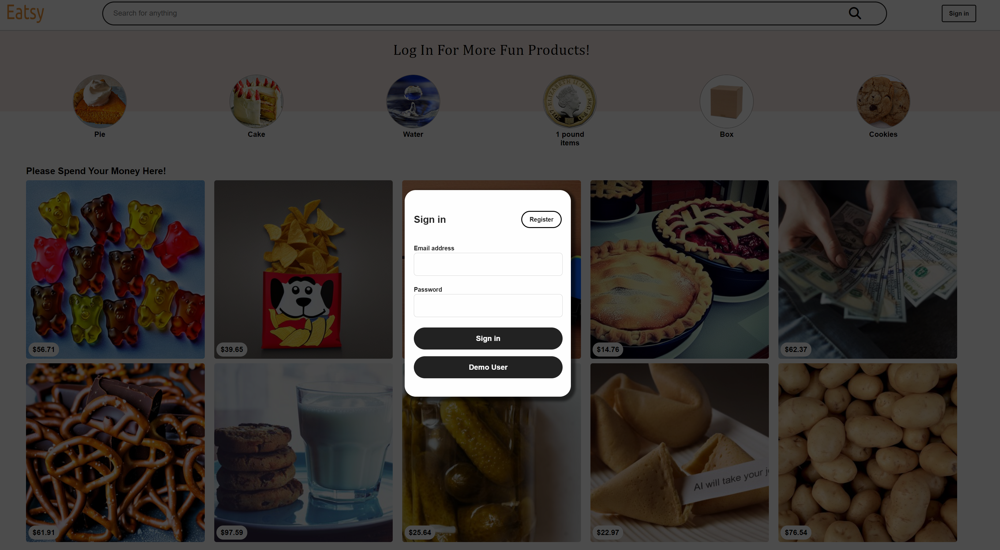

Sign Up modal

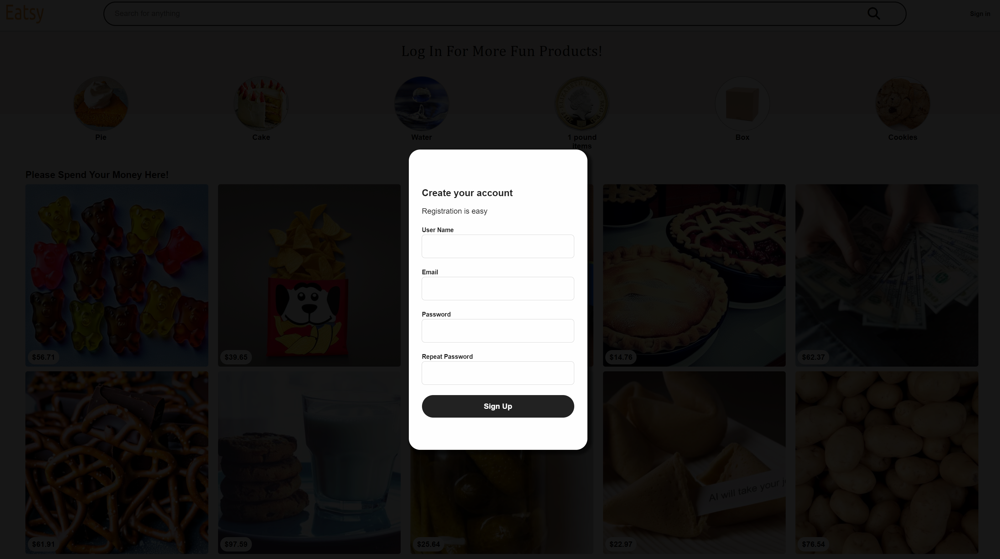

Profile dropdown

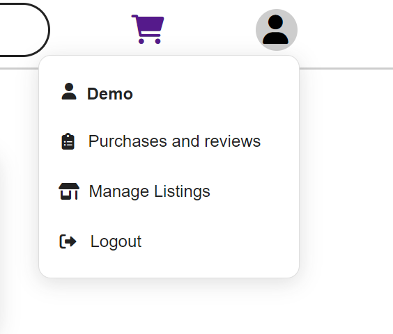

## View One Item at a time

From homepage, when a user clicks on a product, they'll be redirect to another page that has all the info about that product

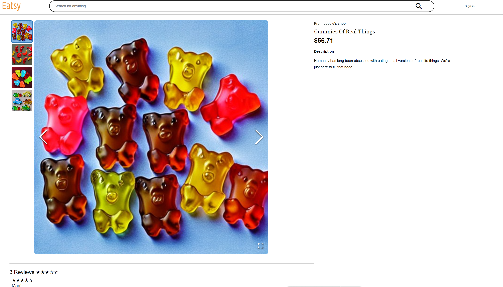

Product's reviews

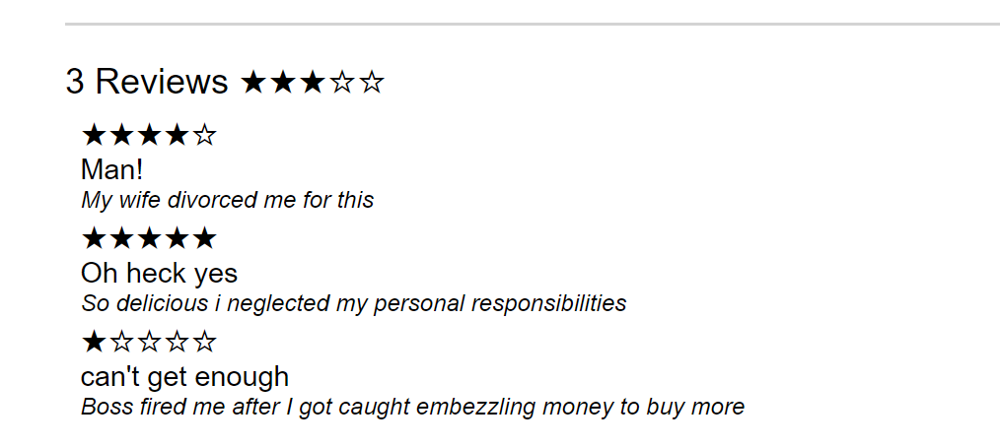

## Manage Listing

When a user wants to start selling, they will be able to click on **Manage Listing** inside profile dropdown

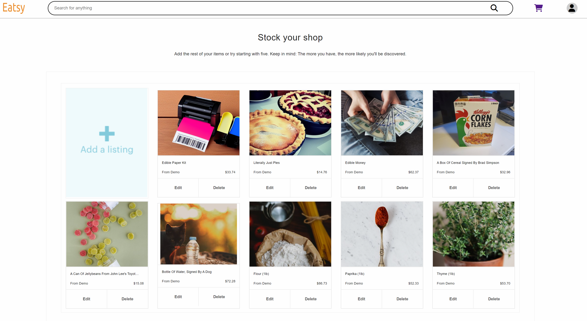

Create item listing form

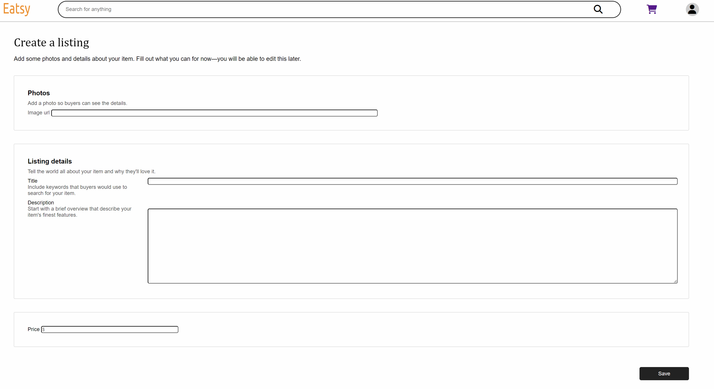

## Purchases and reviews

When a user wants to see purchase history and their reviews, they will be able to click on **Purchases and reviews** inside profile dropdown

Purchase history and review

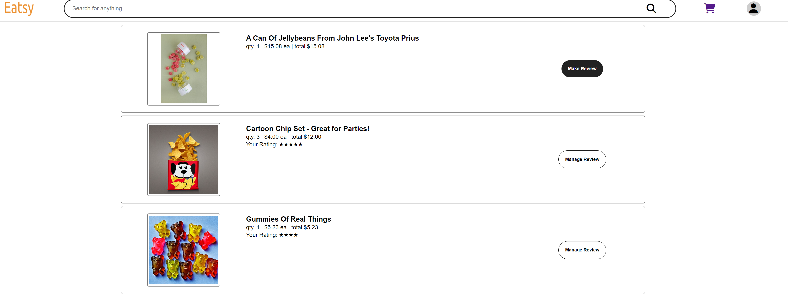

Create review modal

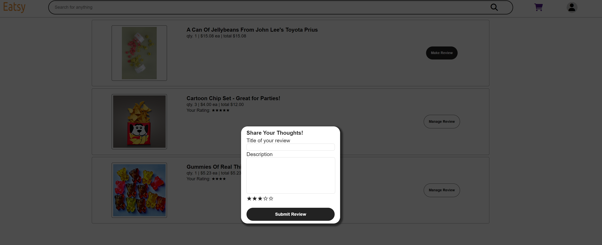

Edit review modal

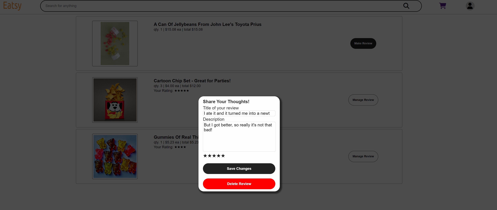

## Shopping cart

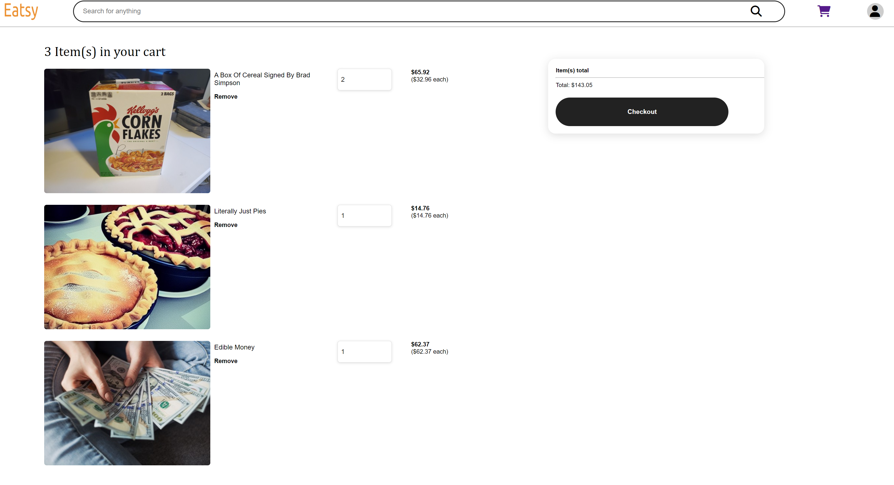

## Features List

- Sign up/in with email

- Browse all products available from homepage

- Buy products by adding to shopping cart and checkout

- View purchase history

- View user's reviews

- View user's selling products

- Edit/delete/create a review for a purchase

- Edit/delete/create an item for sell

[Feature List](https://github.com/Anbui0115/Etsy-group-project/wiki/Features-MVP)

[DB Schema](https://github.com/Anbui0115/Etsy-group-project/wiki/Schema)

[Redux Store Shape](https://github.com/Anbui0115/Etsy-group-project/wiki/Redux-State-Shape-Eatsy)

## API routes document

[API Routes Documentation](https://github.com/Anbui0115/Etsy-group-project/wiki/Eatsy-API-Documentation)

## Frontend routes document

- "/": Homepage

- "/": Get all items

- "/users": List of users

- "/users/:userId": Detail of a user

- "/search": Search

- "/items/:itemId": Get item by id

- "/listings": Get user's listing

- "/cart": Add to shopping cart

- "/listing/:itemId/edit": Edit user's item by id

- "/listings/create": Create new item ",

- "/purchases-and-reviews": Get user's purchase history and reviews

## Instructions on how to build/run the project

[Instructions](https://github.com/Anbui0115/Etsy-group-project/wiki/Instructions-on-how-to-build-run-the-project)

## React Components list

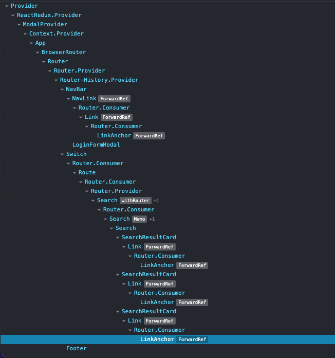

## To-dos/future features

## Technical implementation details

- As a group, we came up with an agreement on how to design our apps effieciently.

- There were two different approaches on how to implement search funtionality, and it took our group some time to discuss and come to an agreement on what needed to be done.

- The image carousel was something we're all proud of.

- Attached below is the snippet of code we use to clear search bar when we navigate away from the search results page.

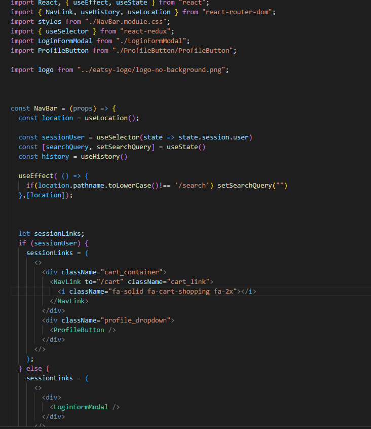

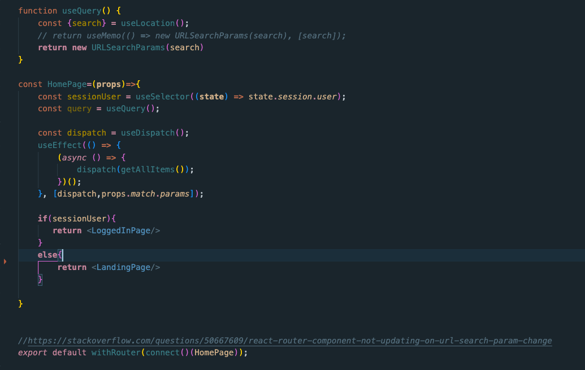
